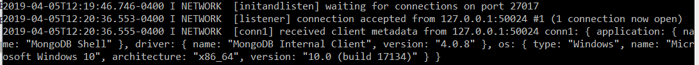
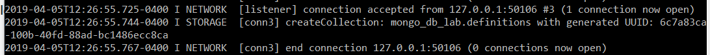
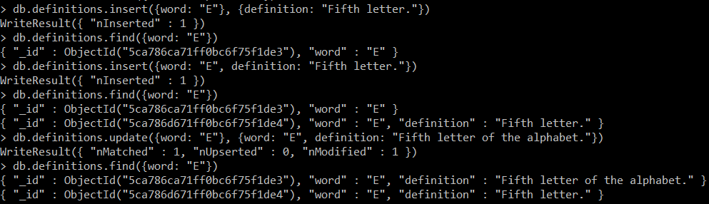
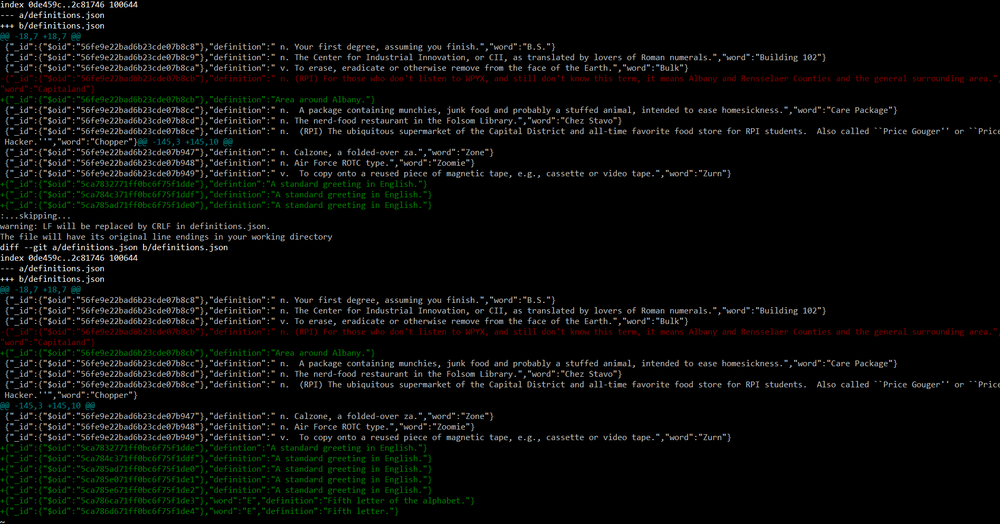
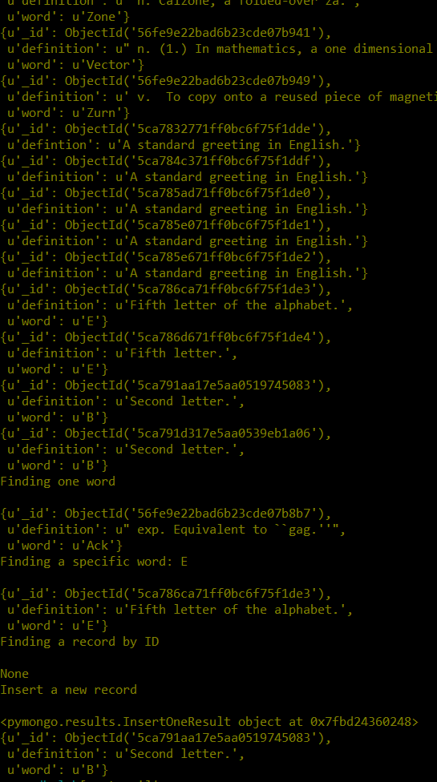
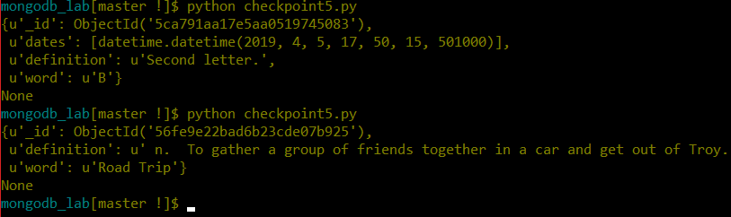

# Lab 10

## Checkpoint 1



## Checkpoint 2



## Checkpoint 3





## Checkpoint 4



```
from pymongo import MongoClient
import pprint
client = MongoClient()

db = client.mongo_db_lab
defs = db.definitions
print("Finding all words\n")
for d in defs.find():
	pprint.pprint(d)
print("Finding one word\n")
pprint.pprint(defs.find_one())
print("Finding a specific word: E\n")
pprint.pprint(defs.find_one({"word": "E"}))
print("Finding a record by ID\n")
pprint.pprint(defs.find_one({"_id": "56fe9e22bad6b23cde07b949"}))
print("Insert a new record\n")
pprint.pprint(defs.insert_one({"word": "B", "definition": "Second letter."}))
pprint.pprint(defs.find_one({"word": "B"}))
```

## Checkpoint 5



```
from pymongo import MongoClient
import pprint
import datetime
client = MongoClient()


def random_word_requester():
	
	'''
	This function should return a random word and its definition and also
	log in the MongoDB database the timestamp that it was accessed.
	'''
	db = client.mongo_db_lab
	defs = db.definitions
	
	result = defs.aggregate([{ "$sample": { "size": 1 } }]).next()
	defs.update(result, { "$push": {"dates": datetime.datetime.utcnow()}})
	pprint.pprint(result)
	return None


if __name__ == '__main__':
	print random_word_requester()
```

